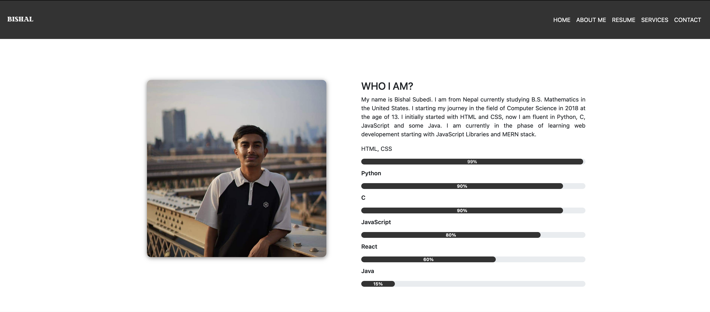
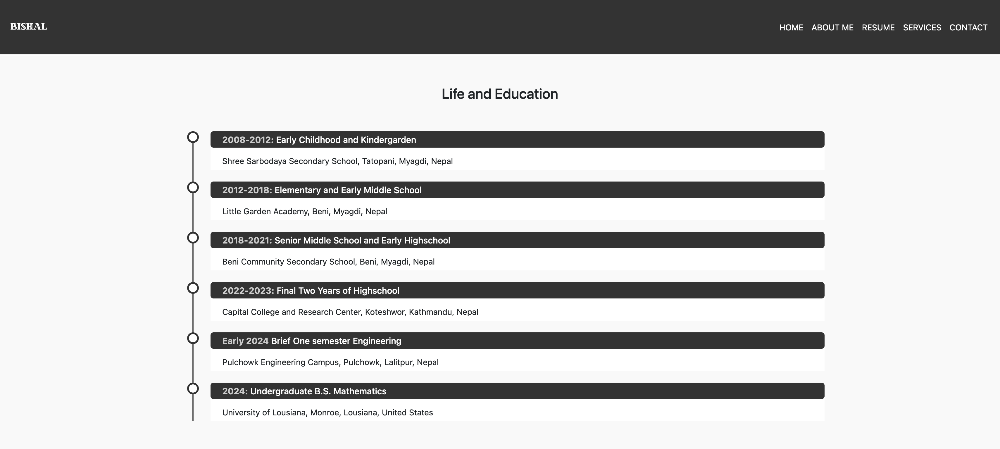
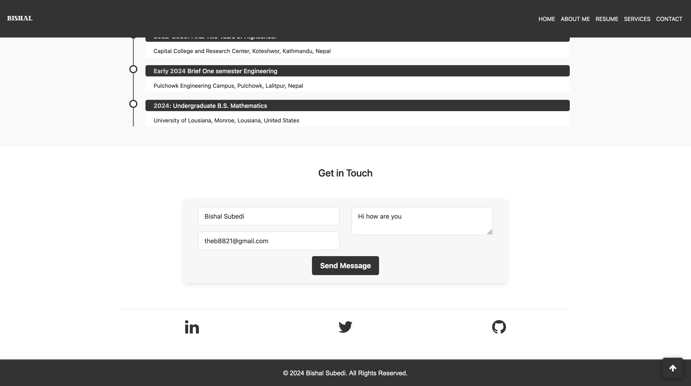

# Bishal Subedi - Personal Portfolio Website

Welcome to my personal portfolio website! This was the site I made in 2020 after learning the HTML & CSS. It reflects my experience in web development, programming, and my academic background.

## Website Overview

### Features

-   **Responsive Design**: Accessible on all devices with a clean and modern layout.
-   **About Me Section**: A brief introduction to my journey and skills.
-   **Skill Progress Bars**: Visual representation of proficiency in different programming languages.
-   **Resume Timeline**: My educational and professional background.
-   **Contact Form**: Easily get in touch with me via a functional web form.
-   **Scroll-to-Top Button**: Smooth navigation for better user experience.
-   **Footer Section**: Includes a copyright notice and links to social media profiles.

### Technologies Used

-   **HTML5**: For structuring content.
-   **CSS3**: For styling and layout.
-   **Bootstrap 4**: For responsive design and components.
-   **Font Awesome**: For attractive icons.
-   **jQuery**: For dynamic interactions (e.g., responsive navbar and smooth scrolling).
-   **Web3Form**: For accepting forms.

## Sections

1. **Header**: Includes my profile picture, name, and a short introduction.
2. **About Me**: A description of my journey and skill bars.
3. **Resume**: My educational timeline.
4. **Contact**: A form to send messages directly.
5. **Footer**: Social media links and a copyright notice.

## Screenshots

### Header Section


### About Me Section



### Education Section



### Contact Form



## Installation

1. Clone the repository:
    ```bash
    git clone https://github.com/theb8821/portfolio-website.git
    ```
